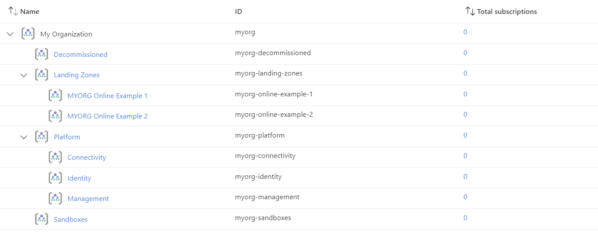

# Deploy Azure landing zones using Terraform

# Prerequisites
Before you start deploying Azure landing zones using Terraform, you need to install Azure CLI, Terraform, to set Terraform up and authenticate it.

# Install Azure CLI on Windows
To install AzureCLI, running the following command in Powershell. The --exact option is to ensure the official Azure CLI package is installed. This command installs the latest version by default. To specify a version, add a --version <version> with your desired version to the command.
```hcl
winget install --exact --id Microsoft.AzureCLI
```
To log in to Azure using the Azure CLI, you can use the az login command, 
```hcl
az login
```
- Login Process:
  - Once you enter the `az login` command, it will provide you with a URL and a code.
  - Open a web browser and go to the provided URL, typically `https://microsoft.com/devicelogin`.
  - Enter the code provided by the CLI.
  - This will prompt you to log in with your Azure account credentials.
- Successful Login:
  - After successfully logging in through the browser, you can return to the command prompt or terminal. It should display the subscriptions associated with your Azure account.
- Setting a Specific Subscription (Optional):
  - If you have multiple subscriptions and want to set a specific one as the default:
- Check Current Account:
  - You can check the details of the currently logged-in account with:
```hcl
az account show
```
# Install Terraform
To install Terraform, find the appropriate download for your operating system on their download page and extract the executable from the ZIP. From there, open your favorite terminal to the directory where it is downloaded. (https://developer.hashicorp.com/terraform/install)
Update your system's global PATH environment variable to include the directory that contains the executable.
Open a terminal window.
```hcl
terraform –-version
```


Authenticating Terraform
Create a service principal and use that to authenticate to Azure using PowerShell.
```hcl
Connect-AzAccount
$sp = New-AzADServicePrincipal -DisplayName tf-demo -Role "Contributor"
```
Then, export several environment variables in the syntax of your shell for authentication. The following is the syntax for PowerShell.
```hcl
$env:ARM_CLIENT_ID       = $sp.AppId
$env:ARM_SUBSCRIPTION_ID = (Get-AzContext).Subscription.Id
$env:ARM_TENANT_ID       = (Get-AzContext).Tenant.Id
$env:ARM_CLIENT_SECRET   = $sp.PasswordCredentials.SecretText
```
With those values stored in environment variables, the AzureRM provider will find and use them to authenticate to Azure.

# Setting up a development environment
To develop Terraform configurations, Visual Studio Code is the recommended editor. Download and install the appropriate installer for your operating system. Then, open the extensions marketplace and search for Terraform. For the best Azure experience, install both the official HashiCorp extension and Microsoft's Azure Terraform extension.

- Benefits of using Terraform
Using Terraform or any infrastructure-as-code tool has several advantages over a graphical user interface like the Azure Portal:

  - Git integration. Terraform allows for version control, collaboration and automation of your infrastructure deployments within a hosted Git and CI/CD delivery.
  - Repeatability. Terraform configurations can be reused across different environments. This ensures consistency and reduces the chance of errors.
  - Extensibility. Terraform's modular architecture allows for integration with other tools and services, which extends its functionality.

- Using Terraform also allows you to scale and standardize complex resources:

  - IAM controls. Terraform lets you define and enforce IAM controls programmatically, providing scalable security governance and compliance across your entire Azure tenant.
  - Policy enforcement. By using Terraform, you can enforce policies across many subscriptions and management groups, ensuring consistent security and compliance practices.
  - Managed resources. Terraform simplifies the management of resources for connectivity landing zones, providing better integration, improved user experience and assured policy compliance.

# Writing the Terraform Configuration

Clone the Azure Landing Zones Terraform Accelerator repository from GitHub:
```hcl
git clone https://github.com/Azure/terraform-azurerm-caf-enterprise-scale.git
cd terraform-azurerm-caf-enterprise-scale
cd examples/level2
```
- To make the code easier to maintain when extending your configuration, we recommend splitting the root module into multiple files. For the purpose of this example, we use the following:

  - terraform.tf
  - variables.tf
  - main.tf
  - lib/archetype_definition_customer_online.json

### `terraform.tf`

The `terraform.tf` file is used to set the provider configuration, including pinning to a specific version (or range of versions) for the AzureRM Provider. For production use, we recommend pinning to a specific version, and not using ranges.

```hcl
# Configure Terraform to set the required AzureRM provider
# version and features{} block.

terraform {
  required_providers {
    azurerm = {
      source  = "hashicorp/azurerm"
      version = "~> 3.107"
    }
  }
}

provider "azurerm" {
  features {}
}
```

### `variables.tf`

The `variables.tf` file is used to declare a couple of example variables which are used to customize deployment of this root module. Defaults are provided for simplicity, but these should be replaced or over-ridden with values suitable for your environment.

```hcl
# Use variables to customize the deployment

variable "root_id" {
  type    = string
  default = "myorg"
}

variable "root_name" {
  type    = string
  default = "My Organization"
}
```

### `main.tf`

The `main.tf` file contains the `azurerm_client_config` resource, which is used to determine the Tenant ID from your user connection to Azure. This is used to ensure the deployment will target your `Tenant Root Group` by default.

It also contains the module declaration for this module, containing a number of customizations as needed to meet the specification defined in the overview above.

To allow the declaration of custom templates, you must create a custom library folder within the root module and include the path to this folder using the `library_path` variable within the module configuration.

> **NOTE:** To learn more about module configuration using input variables, please refer to the [Module Variables](%5BUser-Guide%5D-Module-Variables) documentation.

```hcl
# Get the current client configuration from the AzureRM provider.
# This is used to populate the root_parent_id variable with the
# current Tenant ID used as the ID for the "Tenant Root Group"
# Management Group.

data "azurerm_client_config" "core" {}

# Declare the Azure landing zones Terraform module
# and provide a base configuration.

module "enterprise_scale" {
  source  = "Azure/caf-enterprise-scale/azurerm"
  version = "<version>" # change this to your desired version, https://www.terraform.io/language/expressions/version-constraints

  default_location = "<YOUR_LOCATION>"

  providers = {
    azurerm              = azurerm
    azurerm.connectivity = azurerm
    azurerm.management   = azurerm
  }

  root_parent_id = data.azurerm_client_config.core.tenant_id
  root_id        = var.root_id
  root_name      = var.root_name
  library_path   = "${path.root}/lib"

  custom_landing_zones = {
    "${var.root_id}-online-example-1" = {
      display_name               = "${upper(var.root_id)} Online Example 1"
      parent_management_group_id = "${var.root_id}-landing-zones"
      subscription_ids           = []
      archetype_config = {
        archetype_id   = "customer_online"
        parameters     = {}
        access_control = {}
      }
    }
    "${var.root_id}-online-example-2" = {
      display_name               = "${upper(var.root_id)} Online Example 2"
      parent_management_group_id = "${var.root_id}-landing-zones"
      subscription_ids           = []
      archetype_config = {
        archetype_id = "customer_online"
        parameters = {
          Deny-Resource-Locations = {
            listOfAllowedLocations = ["eastus", ]
          }
          Deny-RSG-Locations = {
            listOfAllowedLocations = ["eastus", ]
          }
        }
        access_control = {}
      }
    }
  }
}
```

### `lib/archetype_definition_customer_online.json`

> **IMPORTANT:** Please ensure you create this file in the `/lib` directory within your root module.

The `lib/archetype_definition_customer_online.json` file contains a custom "archetype definition". This is a custom JSON format used specifically by the Azure landing zones Terraform module.

In this example, we are using this archetype definition to create an archetype with the name `customer_online`. This archetype definition includes the creation of Policy Assignments for `Deny-Resource-Locations` and `Deny-RSG-Locations`, with default values pre-defined in the archetype definition template.

For more details about working with archetype definitions, please refer to the [archetype definition user guide](%5BUser-Guide%5D-Archetype-Definitions).

```json
{
  "customer_online": {
    "policy_assignments": ["Deny-Resource-Locations", "Deny-RSG-Locations"],
    "policy_definitions": [],
    "policy_set_definitions": [],
    "role_definitions": [],
    "archetype_config": {
      "parameters": {
        "Deny-Resource-Locations": {
          "listOfAllowedLocations": [
            "eastus",
            "eastus2",
            "westus",
            "northcentralus",
            "southcentralus"
          ]
        },
        "Deny-RSG-Locations": {
          "listOfAllowedLocations": [
            "eastus",
            "eastus2",
            "westus",
            "northcentralus",
            "southcentralus"
          ]
        }
      },
      "access_control": {}
    }
  }
}
```

# Deploying the Terraform Configuration
Now that you have your configuration set up, you need to deploy it.

- Initialize Terraform with terraform init.
Terraform is initializing the environment. It should end with the following.

- Run terraform validate
Run terraform validate to do some pre-deployment tests on the configuration. This step is not required, but it will give you confidence before running a plan.

- Run terraform plan
Run terraform plan, which will show you what it intends to create. Because this module is so complex, there are going to be a lot of resources created. The following is the last item listed.

The last line indicates that it will create 233 items, change 0 and destroy 0. If you are running this plan again after deploying it and then editing the config, you will likely see resources being changed.

- Run terraform apply,
Run terraform apply, and type in "yes" when prompted to confirm the plan to apply this configuration.

Be patient for the deployment -- it will take some time.

Once the deploy has completed, you should see the following message.

# Deployed Management Groups



You have successfully created the default Management Group resource hierarchy including additional Management Groups for demonstrating custom Landing Zone archetypes, along with the recommended Azure Policy and Access control (IAM) settings for your Azure landing zone.


# View the resources in Azure
You can find the set of management groups (https://www.techtarget.com/searchcloudcomputing/tip/Get-to-know-the-Azure-resource-hierarchy) and policies by going to the Management Group section in the Azure Portal.

Click on the My Organization link, expand the Governance section on the left and then click on Policy. From the Policy screen, go to Compliance.

Here you will see the policies applied by the default configuration of the landing zone. The following shows the location of the censored policies.

# Delete the resources
If you are deploying these resources as a test and you are done evaluating the deployment, you can destroy the deployed resources with terraform destroy. This will destroy only the resources you created.


